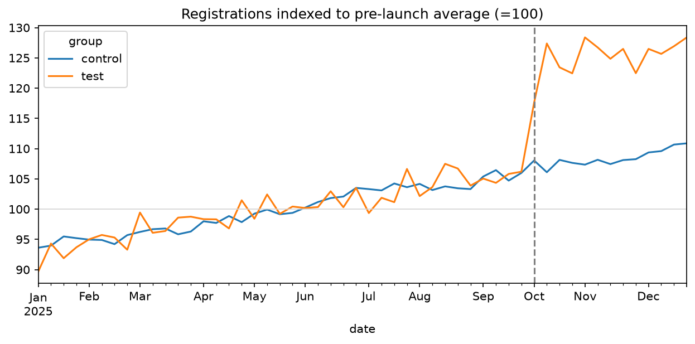
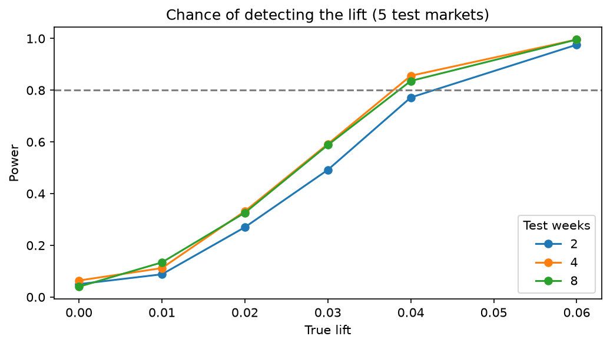

# Geo Incrementality: Measuring True Campaign Lift

**Question:** A paid campaign ran in 5 of 20 markets starting Oct 1. Did it drive incremental registrations, and what did each one really cost?

**Answer:** Yes. The campaign lifted registrations **15.4%** (95% CI: 14.0% to 16.8%, p < 0.001), about 15,600 incremental registrations at an **incremental CPA of $44**, roughly **3x** the $15 CPA the ad platform would report.



## Recommendations
- **Budget on incremental CPA ($41 to $48), not platform CPA.** Platform attribution credits conversions that would have happened anyway.
- **Add markets, not weeks, to detect smaller effects.** With 5 test markets the minimum detectable effect is about 4%, and an 8-week test performs no better than a 4-week one. Moving to 10 test markets brings it to about 3%.



## Results vs. ground truth
The data is simulated with a known 15% lift, so each method can be graded against the truth.

| Method | Estimated lift |
|---|---|
| Naive pre/post (test markets only) | 25.7% |
| Manual 2×2 difference-in-differences | 15.8% |
| DiD regression (two-way fixed effects) | 15.4% (14.0% to 16.8%) |
| **True lift** | **15.0%** |

The naive comparison overstates lift by about 70% because it credits the campaign with organic growth that control markets also saw.

## Approach
| Step | Notebook | What it does |
|---|---|---|
| Simulate | `01` | 20 markets × 365 days with seasonality, trend, noise, and a known lift |
| Validate | `02` | Parallel-trends check and placebo tests on fake launch dates (all within ±0.5%) |
| Estimate | `02` | DiD on log registrations with market and date fixed effects, market-clustered standard errors |
| Business impact | `02` | Incremental registrations and CPA vs. platform-reported CPA |
| Power analysis | `04` | 9,000 simulated tests to find the minimum detectable effect by test length and market count |

## Limitations
- Simulated data is cleaner than real geo data. Real markets trend apart more.
- With 5 treated markets, clustered standard errors can understate uncertainty. Synthetic control is a planned robustness check.
- Spend ($1,500 per market per day) and platform attribution share (40%) are illustrative assumptions.

## Run it
```
python3 -m venv .venv && source .venv/bin/activate
pip install -r requirements.txt
jupyter notebook
```
Run the notebooks in order. Notebook `01` generates `data/geo_test.csv`.